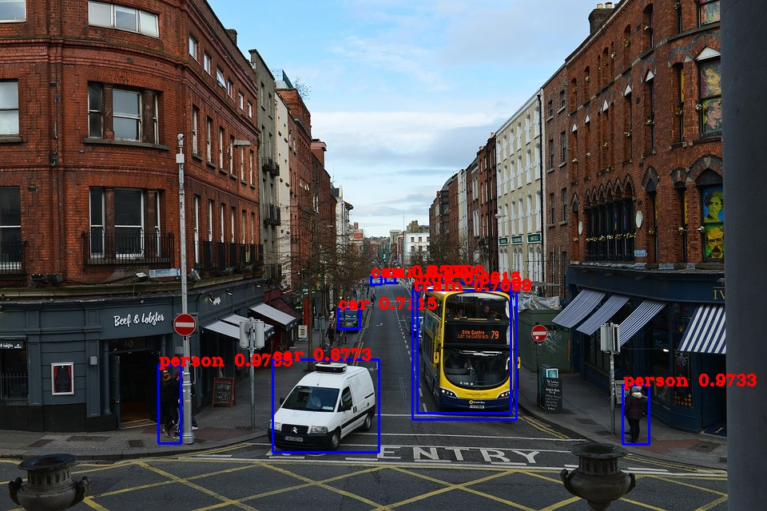

# YOLO-V3-IMPLEMENTATION

In this project, I tried to establish a decent understanding from YOLO to see how the model works and the key that made it successful.To distinguish this project from others I have also implemented the YOLOv3 algorithm from scratch using PyTorch and explained the general architecture and algorithm itself.

## List of Content

- [Introduction to YOLO](#introduction-to-yolo)
- [YOLOv3](#YOLOv3)
- [Loss function](#loss-function)
- [Non-max Suppression](#son-max-suppression)
- [Results](#results)
- [Implementation](#implementation)
- [Requirements](#requirements)
- [Dataset](#dataset)
- [Conclusion](#conclusion)
- [Refrences](#refrences)

## Introduction to YOLO

YOLO is one of the famous object detection algorithms, introduced in 2015 by Joseph Redmon et al. Its idea is to detect an image by running it through a neural network only once, as its name implies( You Only Look Once). The advantage of using this method is it can locate an object in real-time. YOLO changed the view to the object detection problems; rather than looking at it as a classification problem, he did it as a regression problem. He used a neural network as a backbone and calculated associate class probabilities.

## YOLOv3

After the original YOLO paper, the second version of YOLO was released. It improved the algorithm by making it faster and more robust. After that, a couple of years down the line, other models like SSD outperformed this model with higher accuracy rates. However, it was still the fastest model out there because of its single neural network approach. When the third version came out, they decided to sacrifice the speed and make it a bit slower (from 45 FPS to 30 FPS). Using a deeper network, they doubled the convolution layers and increased the backbone architecture model they called DarkNet.

The third version of the algorithm tried to use state-of-the-art strategies to create a more robust network. It incorporated residual networks, skip connections, and upsampling to a good extend. Moreover, this version of YOLO took advantage of 1x1 kernels in Conv layers, a common technique nowadays. Essentially, it does a one-by-one mapping, but if implemented correctly, it can reduce the computational complexity a lot. I suggest reading [this](https://stats.stackexchange.com/questions/194142/what-does-1x1-convolution-mean-in-a-neural-network) comment if you need more exact information about that topic. Down below, you can see a detailed illustration of the model architecture made by [Ayoosh Kathuria](https://medium.com/@ayoosh).
